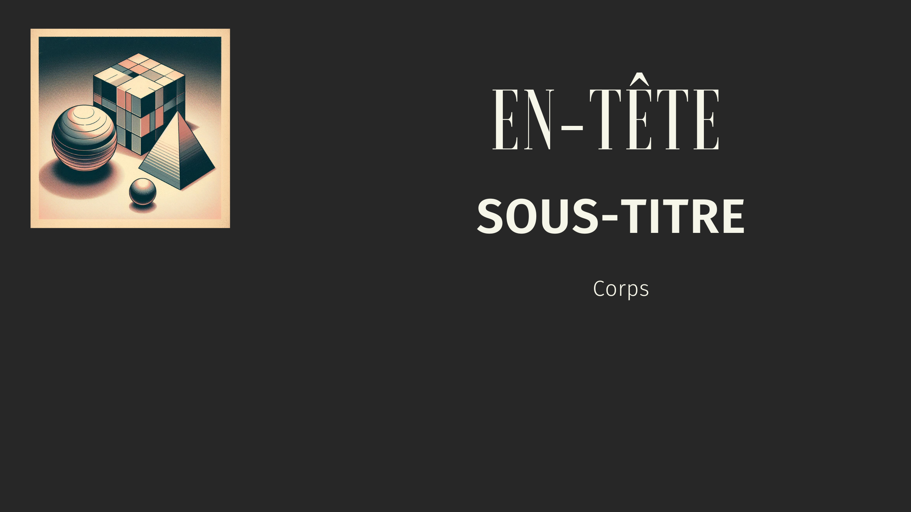

## 👋 Salut !

Je m'appelle Mohamed, un développeur enthousiaste qui aime explorer de nouvelles technologies et créer des solutions innovantes. 🚀

  

## 📫 Connectez-vous avec moi :

  
  

## 🛠️ Langages et outils :

 
   
  
   
   
   
   
   
   
   

## 📊 Statistiques GitHub :

&nbsp;

